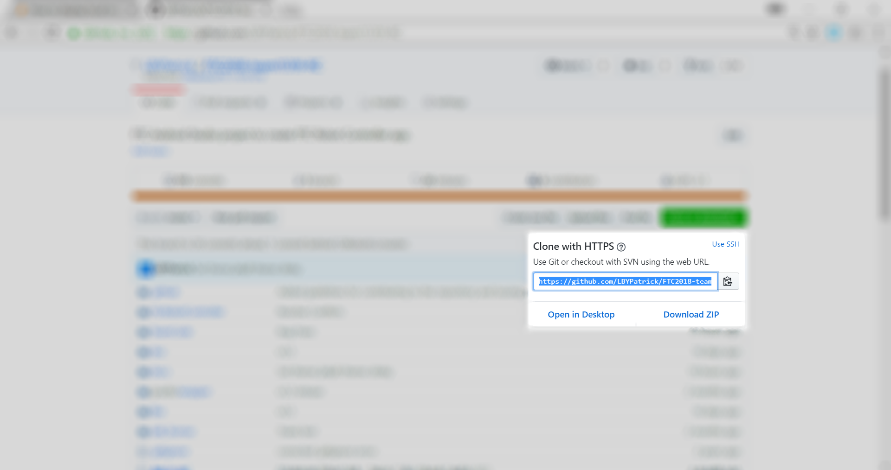
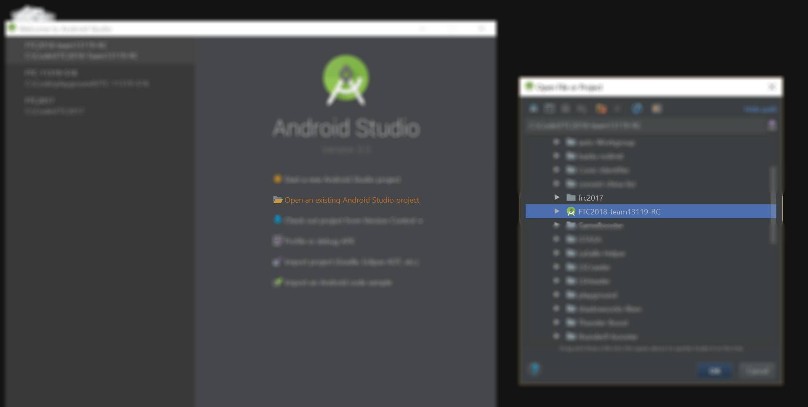
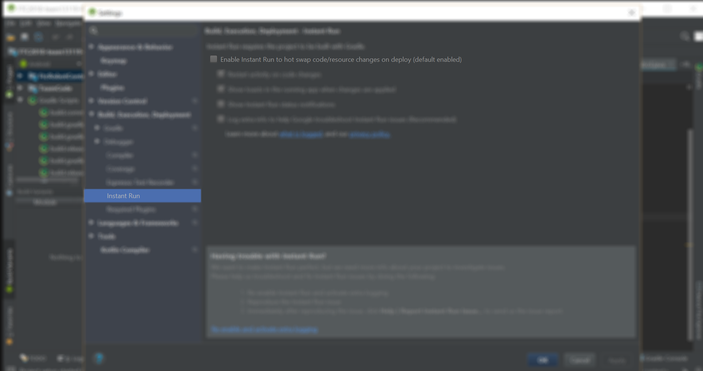

# FTC 2018 Relic Recovery Programming Guide

## Who wrote this guide?

FRC 5181 LaSalle Robotics, PA.


## Setting Up

**If your code is not in Github, Skip Step One.**
1. In Github, Clone the project to your computer.

> Suppose the team project is [FTC2018-team11319-RC](https://github.com/LBYPatrick/FTC2018-team11319-RC), then in the [git](https://git-scm.com/) client in my computer, you need to  enter:
>```
> git clone https://github.com/LBYPatrick/FTC2018-team11319-RC
>```



2. Use Android Studio to open the project you cloned.



3. In ``File`` -- ``Settings...`` -- ``Build,Execution,Deployment`` -- ``Instant Run``, you need to make sure the **"Enable Instant Run..."** is ***NOT*** checked. Check [This Issue](https://github.com/ftctechnh/ftc_app/issues/364) in the offical repository for more info.



4. In your **Robot Controller** phone, go to ``Settings`` -- ``General``-- ``About`` and hit ``kernel number`` 5 times so that you can enable ``Developer Mode`` (Different Android ROM might have different ways to activate Developer Mode, you might want to google you are not Nexus 5X/HTC/LG). Then in ``General``--``Developer Mode``, enable **"USB Debugging"**.

5. Plug the **Robot Controller** phone to your computer and hit the play button in the android studio (located at the top toolbox). Select the phone and click OK.

# Configuration 

1. In the phone, hit **Configure Bot**, then **New** a config for you robot based on the device names you specified in the code.

Coming soon...